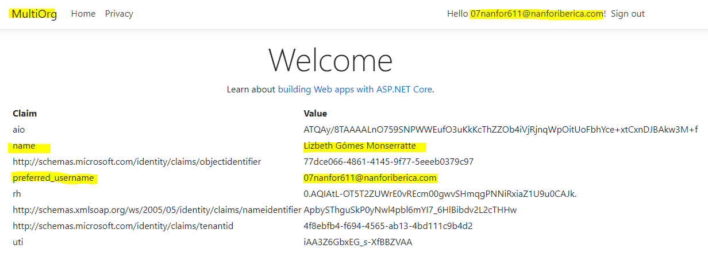
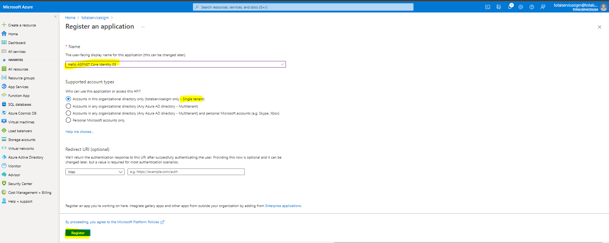

## Alumno: Lizbeth Gómes Monserratte

## <u>Módulo MS-600</u>
####  Building Applications and Solutions with Microsoft 365 Core Services

# Evidencias Lab 01

|  | **Ejercicio** | **Descripción**                                                  |
| -------- | --------- | ------------------------------------------------------------ |
| **Lab 01** |  ✔ |                                                              |
|        |    | 01-Student-lab-manual.md                                     |
|        | [01](https://github.com/liztraining2021/MS-600-Building-Applications-and-Solutions-with-Microsoft-365-Core-Services/tree/master/Lab01#ejercicio-1) | 02-Exercise-1-Registering-an-application-in-Azure-Active-Directory.md |
|        | [02](https://github.com/liztraining2021/MS-600-Building-Applications-and-Solutions-with-Microsoft-365-Core-Services/tree/master/Lab01#ejercicio-2) | 03-Exercise-2-Implementing-authentication.md                 |
|        | [03](https://github.com/liztraining2021/MS-600-Building-Applications-and-Solutions-with-Microsoft-365-Core-Services/tree/master/Lab01#ejercicio-3) | 04-Exercise-3-Implementing-application-that-supports-B2B.md  |
|        | [04](https://github.com/liztraining2021/MS-600-Building-Applications-and-Solutions-with-Microsoft-365-Core-Services/tree/master/Lab01#ejercicio-4) | 05-Exercise-4-Configuring-permissions-to-consume-an-API.md   |
|        | [05](https://github.com/liztraining2021/MS-600-Building-Applications-and-Solutions-with-Microsoft-365-Core-Services/tree/master/Lab01#ejercicio-5) | 06-Exercise-5-Implementing-authorization-to-consume-an-API.md |
|        | [06](https://github.com/liztraining2021/MS-600-Building-Applications-and-Solutions-with-Microsoft-365-Core-Services/tree/master/Lab01#ejercicio-6) | 07-Exercise-6-Creating-a-service-to-access-Microsoft-Graph.md |

# Ejercicio 1

# Ejercicio 2

# Ejercicio 3

# Ejercicio 4

# Ejercicio 5

# Ejercicio 6

# [Volver >>>](https://github.com/liztraining2021/MS-600-Building-Applications-and-Solutions-with-Microsoft-365-Core-Services/blob/master/readme.md)

