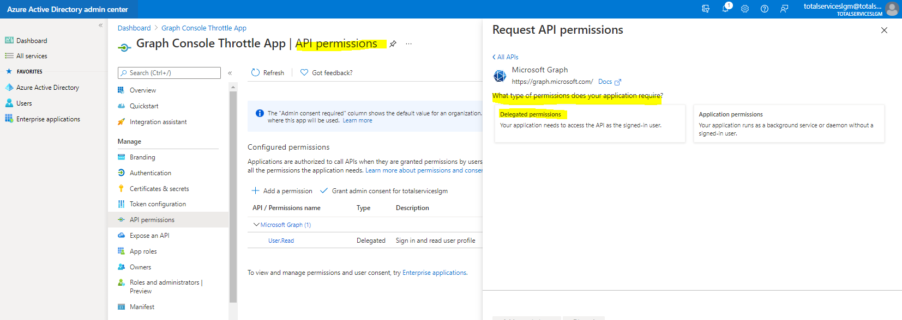

## Alumno: Lizbeth Gómes Monserratte

## <u>Módulo MS-600</u>
####  Building Applications and Solutions with Microsoft 365 Core Services

# Evidencias Lab 02

|     | **Ejercicio** | **Descripción**                                                  |
| -------- | --------- | ------------------------------------------------------------ |
| **Lab 02** | ✔   |  |
|        |         | 01-Student-lab-manual.md                                     |
|        | [01](https://github.com/liztraining2021/MS-600-Building-Applications-and-Solutions-with-Microsoft-365-Core-Services/blob/main/Lab02/Readme.md#ejercicio-1) | 02-Exercise-1-Using-query-parameters-when-querying-Microsoft-Graph-via-HTTP.md |
|        | [02](https://github.com/liztraining2021/MS-600-Building-Applications-and-Solutions-with-Microsoft-365-Core-Services/blob/main/Lab02/Readme.md#ejercicio-2) | 03-Exercise-2-Retrieve-and-control-information-returned-from-Microsoft-Graph.md |
|        | [03](https://github.com/liztraining2021/MS-600-Building-Applications-and-Solutions-with-Microsoft-365-Core-Services/blob/main/Lab02/Readme.md#ejercicio-3) | 04-Exercise-3-Using-change-notifications-and-track-changes-with-Microsoft-Graph.md |
|        | [04](https://github.com/liztraining2021/MS-600-Building-Applications-and-Solutions-with-Microsoft-365-Core-Services/blob/main/Lab02/Readme.md#ejercicio-4) | 05-Exercise-4-Reduce-traffic-with-batched-requests.md        |
|        | [05](https://github.com/liztraining2021/MS-600-Building-Applications-and-Solutions-with-Microsoft-365-Core-Services/blob/main/Lab02/Readme.md#ejercicio-5) | 06-Exercise-5-Understand-throttling-in-Microsoft-Graph.md    |
|        | [06](https://github.com/liztraining2021/MS-600-Building-Applications-and-Solutions-with-Microsoft-365-Core-Services/blob/main/Lab02/Readme.md#ejercicio-6) | 07-Exercise-6-Querying-user-data-from-Microsoft-Graph.md     |

# Ejercicio 1

# Ejercicio 2

# Ejercicio 3

# Ejercicio 4

# Ejercicio 5

# Ejercicio 6

# [Volver >>>](https://github.com/liztraining2021/MS-600-Building-Applications-and-Solutions-with-Microsoft-365-Core-Services/blob/master/readme.md)

