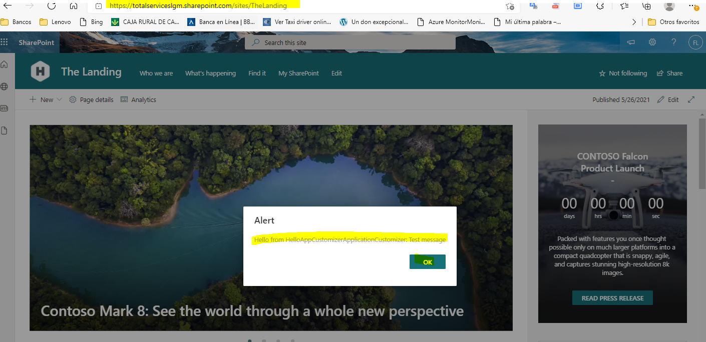
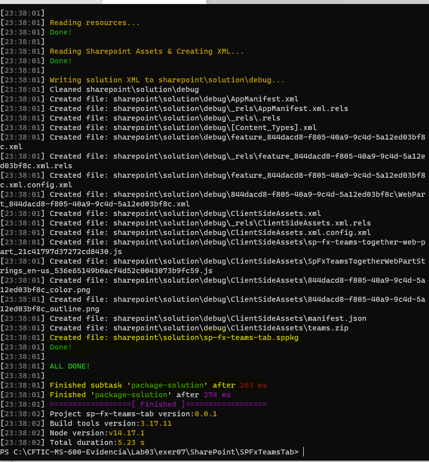
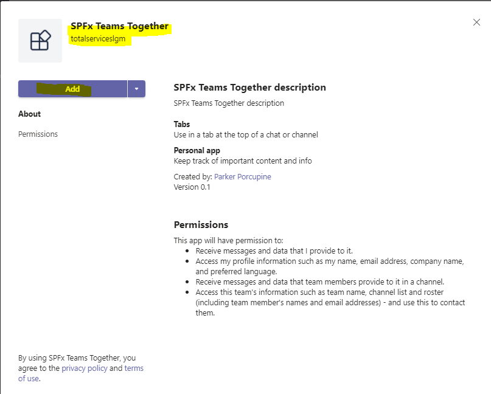

## Alumno: Lizbeth Gómes Monserratte

## <u>Módulo MS-600</u>
####  Building Applications and Solutions with Microsoft 365 Core Services

# Evidencias Lab 03

|  | **Ejercicio** | **Descripción**                                                  |
| -------- | --------- | ------------------------------------------------------------ |
| **Lab 03** |  ✔ | https://github.com/liztraining2021/MS-600-Building-Applications-and-Solutions-with-Microsoft-365-Core-Services/blob/main/Lab03/Readme.md#ejercicio-1 |
|        |    | 01-Student-lab-manual.md                                     |
|        | [01](https://github.com/liztraining2021/MS-600-Building-Applications-and-Solutions-with-Microsoft-365-Core-Services/blob/main/Lab03/Readme.md#ejercicio-1) | 02-Exercise-1-Introduction-to-SharePoint-Framework-(SPFx).md |
|        | [02](https://github.com/liztraining2021/MS-600-Building-Applications-and-Solutions-with-Microsoft-365-Core-Services/blob/main/Lab03/Readme.md#ejercicio-2) | 03-Exercise-2-Working-with-the-web-part-property-pane.md |
|        | [03](https://github.com/liztraining2021/MS-600-Building-Applications-and-Solutions-with-Microsoft-365-Core-Services/blob/main/Lab03/Readme.md#ejercicio-4) | 04-Exercise-3-Creating-SharePoint-Framework-Extensions.md |
|        | [04](https://github.com/liztraining2021/MS-600-Building-Applications-and-Solutions-with-Microsoft-365-Core-Services/blob/main/Lab03/Readme.md#ejercicio-4) | 05-Exercise-4-Creating-a-command-set-extension.md |
|        | [05](https://github.com/liztraining2021/MS-600-Building-Applications-and-Solutions-with-Microsoft-365-Core-Services/blob/main/Lab03/Readme.md#ejercicio-5) | 06-Exercise-5-Creating-a-field-customizer-extension.md |
|        | [06](https://github.com/liztraining2021/MS-600-Building-Applications-and-Solutions-with-Microsoft-365-Core-Services/blob/main/Lab03/Readme.md#ejercicio-6) | 07-Exercise-6-Deploying-a-SharePoint-Framework-solution.md |
|        | [07](https://github.com/liztraining2021/MS-600-Building-Applications-and-Solutions-with-Microsoft-365-Core-Services/blob/main/Lab03/Readme.md#ejercicio-7) | 08-Exercise-7-Deploying-SPFx-solutions-to-Microsoft-Teams.md |
|

# Ejercicio 1

# Ejercicio 2

# Ejercicio 3

# Ejercicio 4

# Ejercicio 5

# Ejercicio 6

# Ejercicio 7

# [Volver >>>](https://github.com/liztraining2021/MS-600-Building-Applications-and-Solutions-with-Microsoft-365-Core-Services/blob/master/readme.md)

