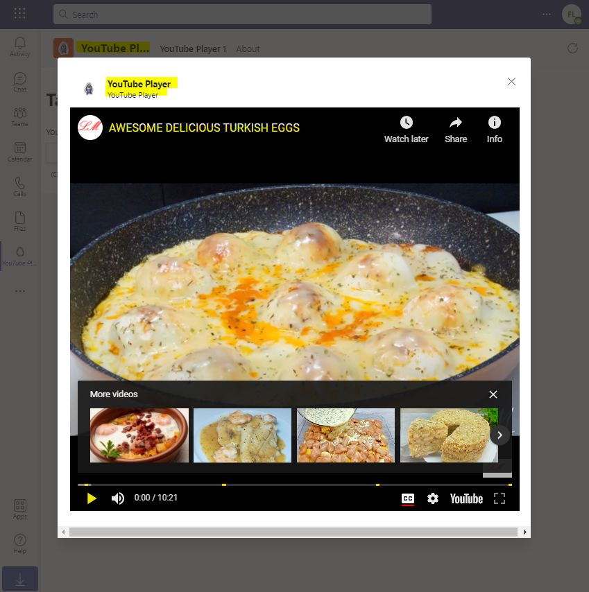
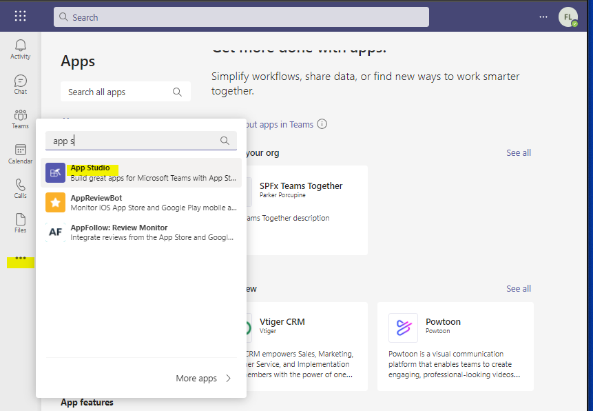
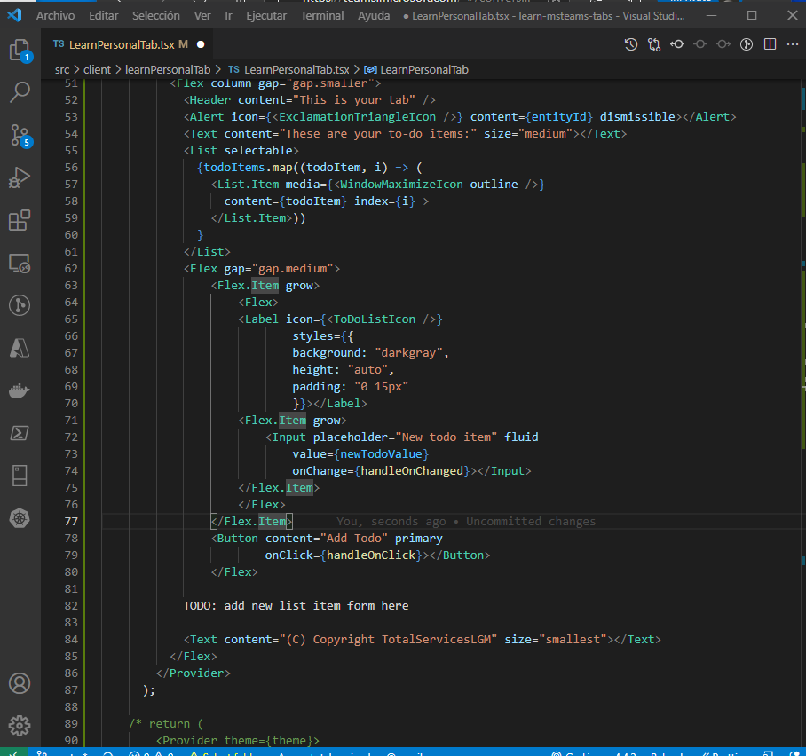
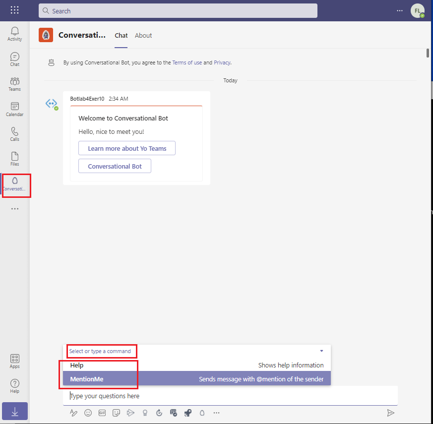
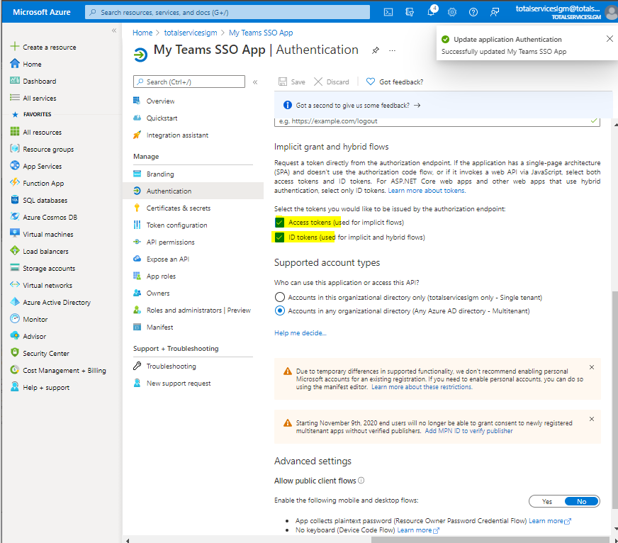
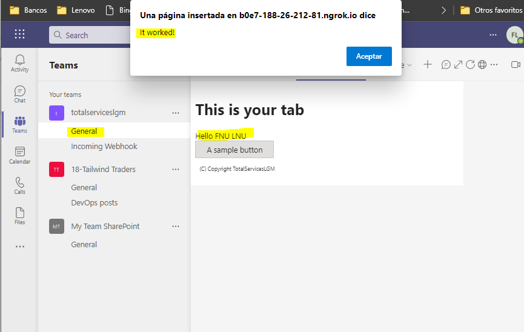
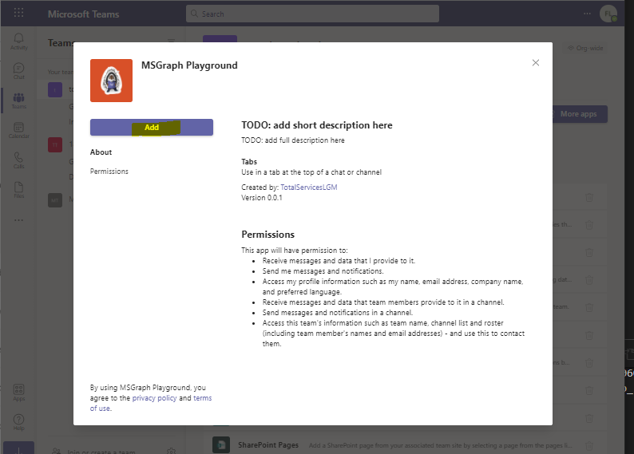

## Alumno: Lizbeth Gómes Monserratte

## <u>Módulo MS-600</u>
####  Building Applications and Solutions with Microsoft 365 Core Services

# Evidencias Lab 04

|  | **Ejercicio** | **Descripción**                                                  |
| -------- | --------- | ------------------------------------------------------------ |
| **Lab 04** |  ✔ |  |
|        |         | 01-Student-lab-manual.md                                     |
|        | [01](https://github.com/liztraining2021/MS-600-Building-Applications-and-Solutions-with-Microsoft-365-Core-Services/tree/main/Lab04#ejercicio-1) | 02-Exercise-1-Collecting-user-input-with-task-modules.md     |
|        | [02](https://github.com/liztraining2021/MS-600-Building-Applications-and-Solutions-with-Microsoft-365-Core-Services/tree/main/Lab04#ejercicio-2) | 03-Exercise-2-Using-adaptive-cards-and-deep-links-in-task-modules.md |
|        | [03](https://github.com/liztraining2021/MS-600-Building-Applications-and-Solutions-with-Microsoft-365-Core-Services/tree/main/Lab04#ejercicio-3) | 04-Exercise-3-Using-task-modules-with-bots.md                |
|        | [04](https://github.com/liztraining2021/MS-600-Building-Applications-and-Solutions-with-Microsoft-365-Core-Services/tree/main/Lab04#ejercicio-4) | 05-Exercise-4-Creating-outgoing-webhooks.md                  |
|        | [05](https://github.com/liztraining2021/MS-600-Building-Applications-and-Solutions-with-Microsoft-365-Core-Services/tree/main/Lab04#ejercicio-5) | 06-Exercise-5-Creating-incoming-webhooks.md                  |
|        | [06](https://github.com/liztraining2021/MS-600-Building-Applications-and-Solutions-with-Microsoft-365-Core-Services/tree/main/Lab04#ejercicio-6) | 07-Exercise-6-Create-a-custom-personal-tab.md                |
|        | [07](https://github.com/liztraining2021/MS-600-Building-Applications-and-Solutions-with-Microsoft-365-Core-Services/tree/main/Lab04#ejercicio-7) | 08-Exercise-7-Create-a-custom-channel-tab.md                 |
|        | [08](https://github.com/liztraining2021/MS-600-Building-Applications-and-Solutions-with-Microsoft-365-Core-Services/tree/main/Lab04#ejercicio-8) | 09-Exercise-8-Creating-action-command-messaging-extensions.md |
|        | [09](https://github.com/liztraining2021/MS-600-Building-Applications-and-Solutions-with-Microsoft-365-Core-Services/tree/main/Lab04#ejercicio-9) | 10-Exercise-9-Creating-search-command-messaging-extensions.md |
|        | [10](https://github.com/liztraining2021/MS-600-Building-Applications-and-Solutions-with-Microsoft-365-Core-Services/tree/main/Lab04#ejercicio-10) | 11-Exercise-10-Creating-conversational-bots.md               |
|        | [11](https://github.com/liztraining2021/MS-600-Building-Applications-and-Solutions-with-Microsoft-365-Core-Services/tree/main/Lab04#ejercicio-11) | 12-Exercise-11-Bots-in-channels-and-group-chats.md           |
|        | [12](https://github.com/liztraining2021/MS-600-Building-Applications-and-Solutions-with-Microsoft-365-Core-Services/tree/main/Lab04#ejercicio-12) | 13-Exercise-12-Sending-proactive-messages-from-bots.md       |
|        | [13](https://github.com/liztraining2021/MS-600-Building-Applications-and-Solutions-with-Microsoft-365-Core-Services/tree/main/Lab04#ejercicio-13) | 14-Exercise-13-Getting-started-with-the-teamwork-endpoint.md |
|        | [14](https://github.com/liztraining2021/MS-600-Building-Applications-and-Solutions-with-Microsoft-365-Core-Services/tree/main/Lab04#ejercicio-14) | 15-Exercise-14-Configure-a-built-in-tab-with-Microsoft-Graph.md |
|        | [15](https://github.com/liztraining2021/MS-600-Building-Applications-and-Solutions-with-Microsoft-365-Core-Services/tree/main/Lab04#ejercicio-15) | 16-Exercise-15-Use-Microsoft-Graph-to-post-to-the-activity-feed.md |
|        | [16](https://github.com/liztraining2021/MS-600-Building-Applications-and-Solutions-with-Microsoft-365-Core-Services/tree/main/Lab04#ejercicio-16) | 17-Exercise-16-Implement-single-sign-on-for-Microsoft-Teams-apps.md |
|        | [17](https://github.com/liztraining2021/MS-600-Building-Applications-and-Solutions-with-Microsoft-365-Core-Services/tree/main/Lab04#ejercicio-17) | 18-Exercise-17-Implement-single-sign-on-with-Microsoft-Teams-tabs.md |
|        | [18](https://github.com/liztraining2021/MS-600-Building-Applications-and-Solutions-with-Microsoft-365-Core-Services/tree/main/Lab04#ejercicio-18) | 19-Exercise-18-Implement-single-sign-on-with-Microsoft-Teams-bots.md |
|        |||

# Ejercicio 1

# Ejercicio 2

# Ejercicio 3

# Ejercicio 4

# Ejercicio 5

# Ejercicio 6

# Ejercicio 7

# Ejercicio 8

# Ejercicio 9

# Ejercicio 10

# Ejercicio 11

# Ejercicio 12

# Ejercicio 13

# Ejercicio 14

# Ejercicio 15

# Ejercicio 16

# Ejercicio 17

# Ejercicio 18

# [Volver >>>](https://github.com/liztraining2021/MS-600-Building-Applications-and-Solutions-with-Microsoft-365-Core-Services/blob/master/readme.md)

