## Alumno: Lizbeth Gómes Monserratte

## <u>Módulo MS-600</u>
####  Building Applications and Solutions with Microsoft 365 Core Services

# Evidencias Lab 05

|  | **Ejercicio** | **Descripción**                                                  |
| -------- | --------- | ------------------------------------------------------------ |
| **Lab 05** |  ✔ |  |
|        |         | 01-Student-lab-manual.md                                     |
|        | [01](https://github.com/liztraining2021/MS-600-Building-Applications-and-Solutions-with-Microsoft-365-Core-Services/blob/main/Lab05/Readme.md#ejercicio-1) | 02-Exercise-1-Understanding-fundamental-components-and-types-of-Office-Add-ins.md |
|        | [02](https://github.com/liztraining2021/MS-600-Building-Applications-and-Solutions-with-Microsoft-365-Core-Services/blob/main/Lab05/Readme.md#ejercicio-2) | 03-Exercise-2-Understanding-Office-JavaScript-APIs.md        |
|        | [03](https://github.com/liztraining2021/MS-600-Building-Applications-and-Solutions-with-Microsoft-365-Core-Services/blob/main/Lab05/Readme.md#ejercicio-3) | 04-Exercise-3-Understanding-customization-of-add-ins.md      |
|        | [04](https://github.com/liztraining2021/MS-600-Building-Applications-and-Solutions-with-Microsoft-365-Core-Services/blob/main/Lab05/Readme.md#ejercicio-4) | 05-Exercise-4-Understanding-actionable-messages.md           |

# Ejercicio 1

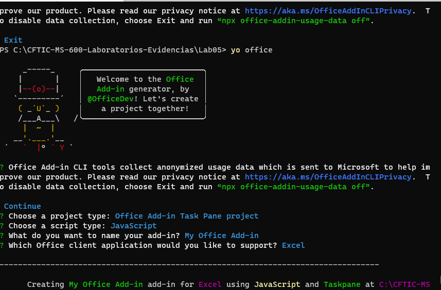

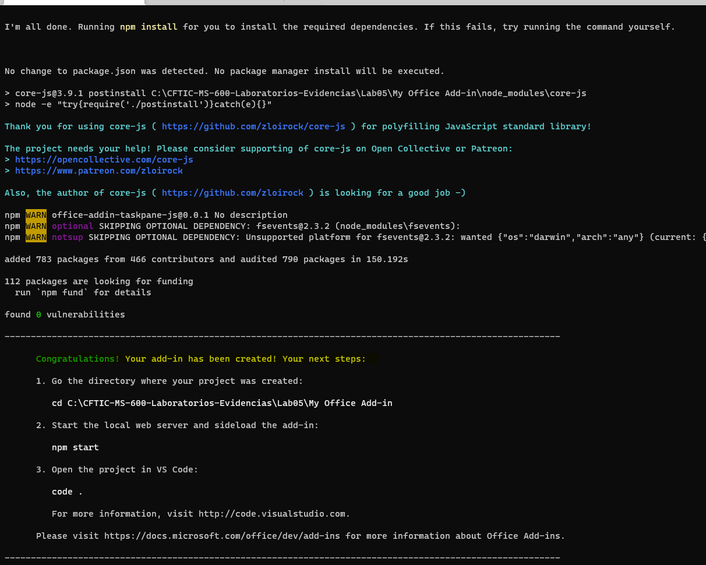

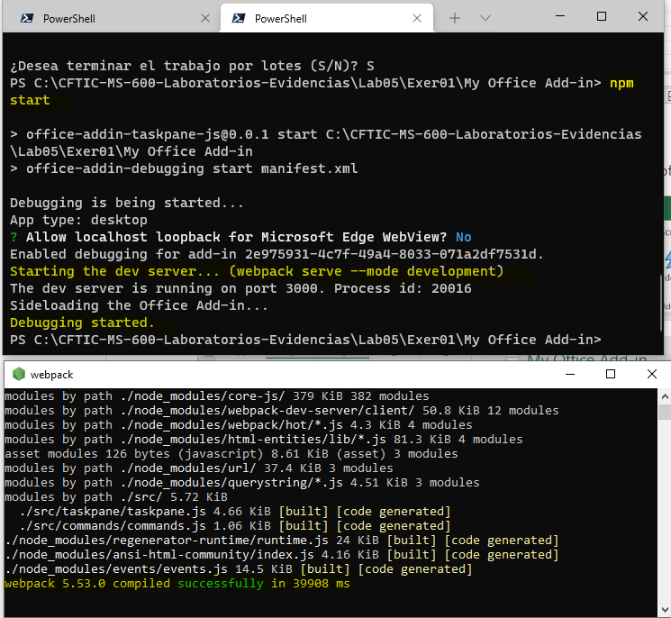

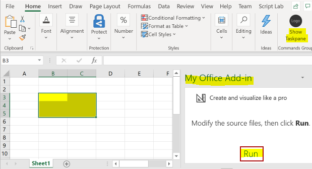

# Ejercicio 2

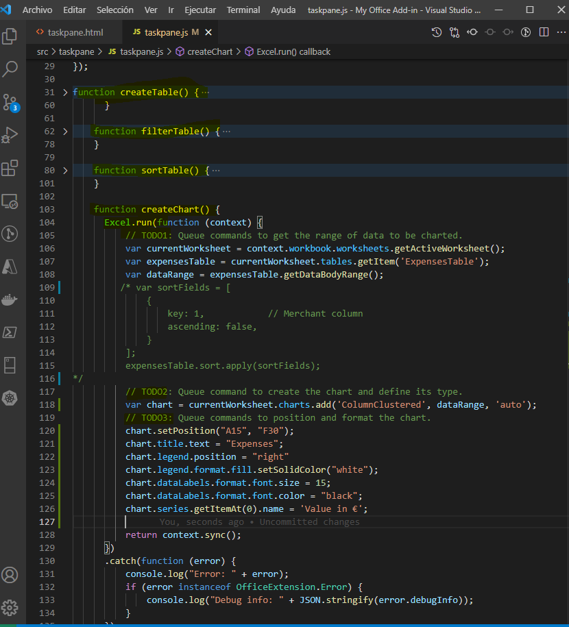

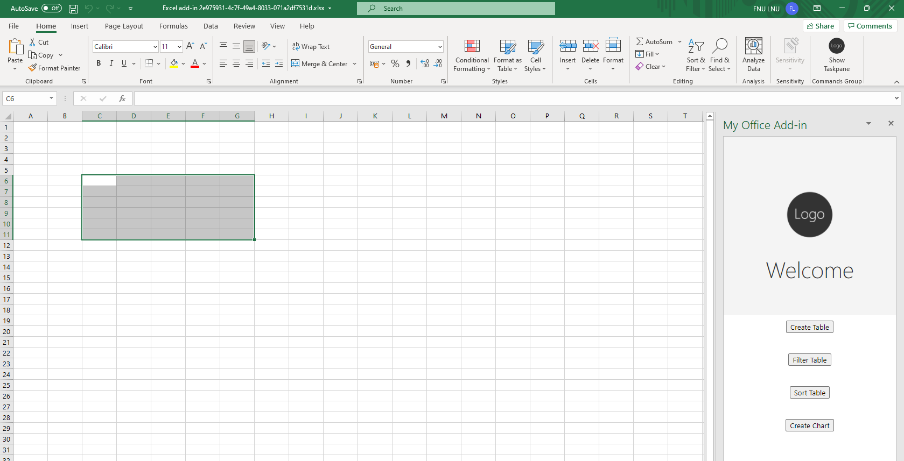

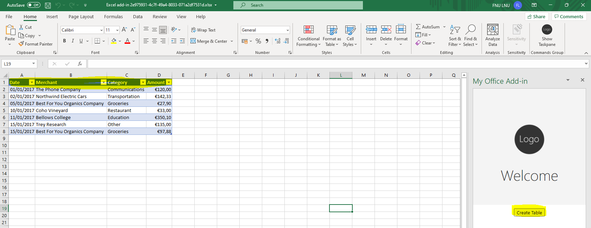

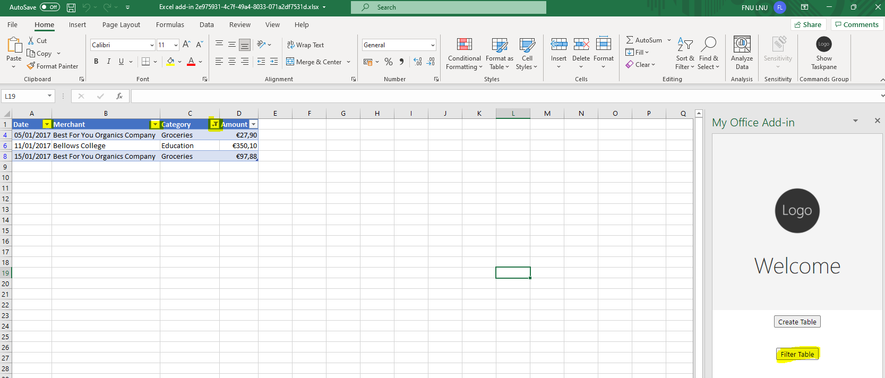

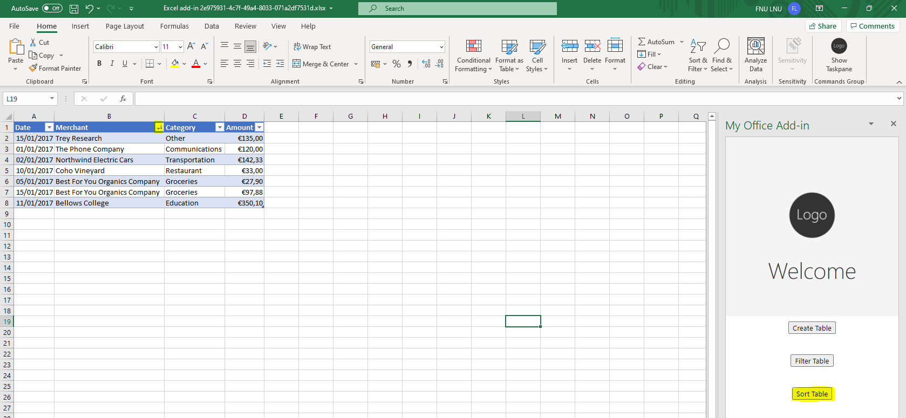

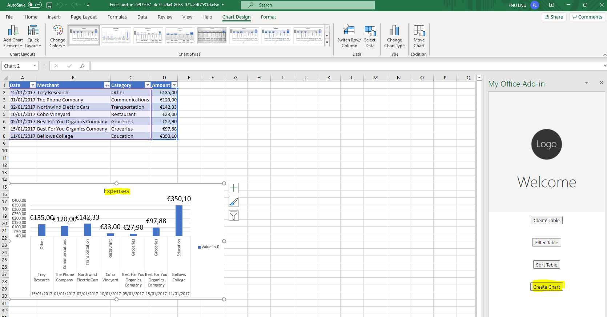

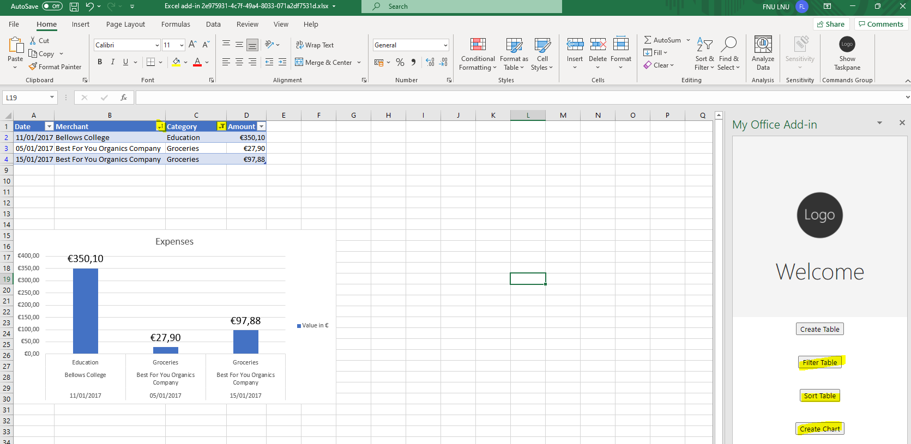

# Ejercicio 3

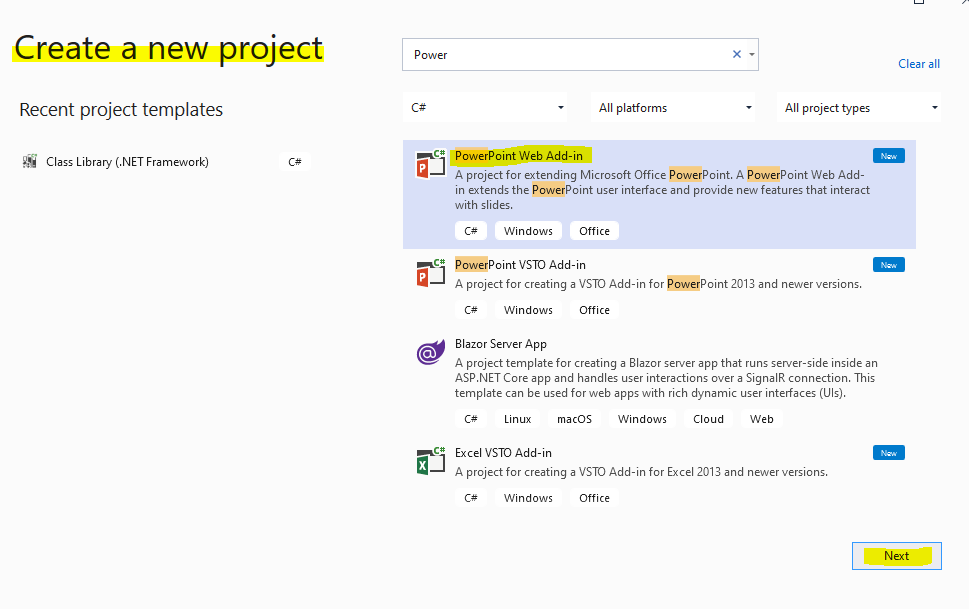

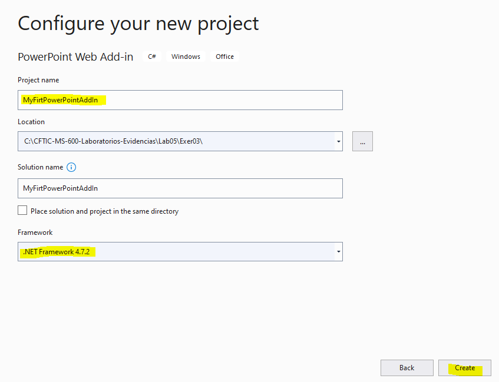

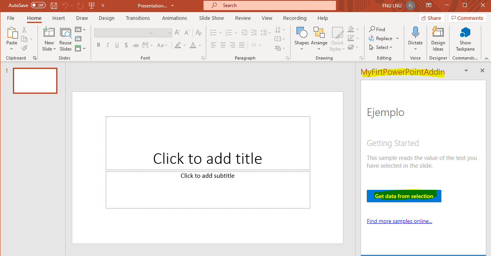

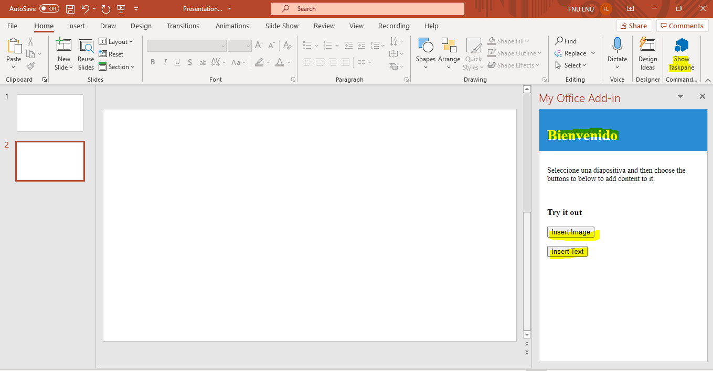

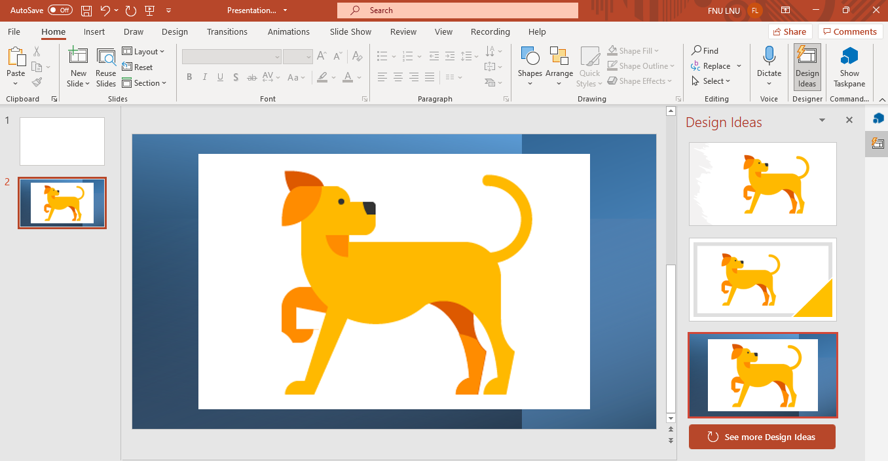

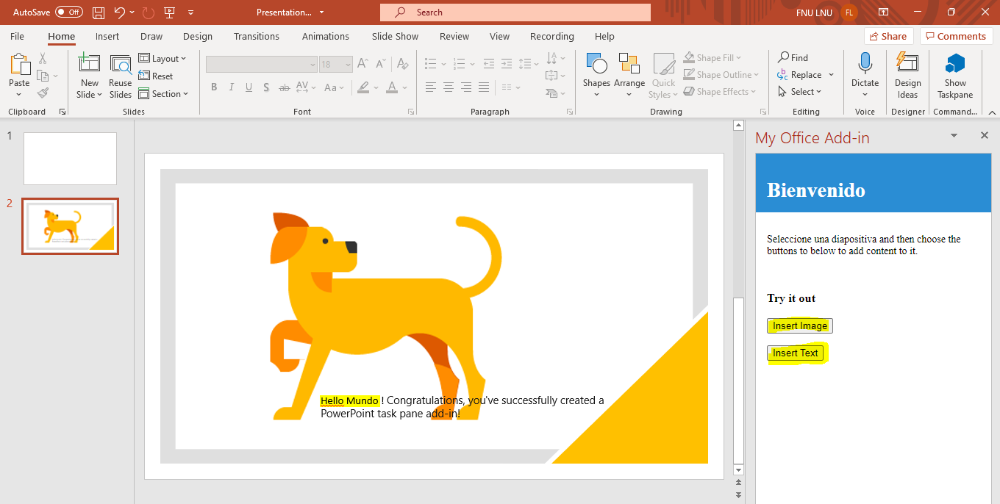

# Ejercicio 4

# [Volver >>>](https://github.com/liztraining2021/MS-600-Building-Applications-and-Solutions-with-Microsoft-365-Core-Services/blob/master/readme.md)